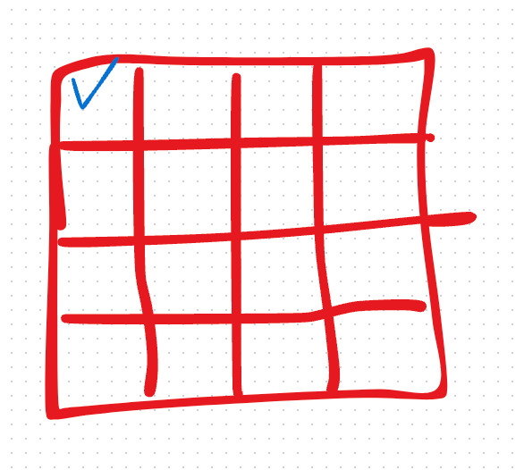
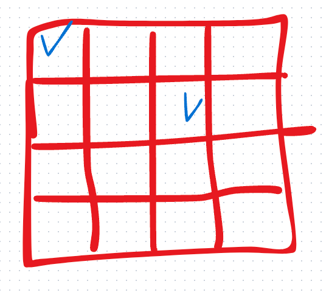
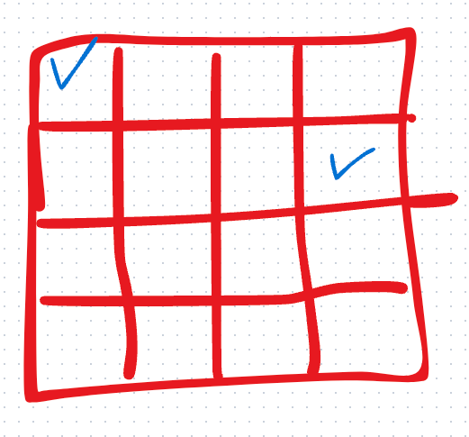

# N - Qeen

```Kotlin
fun main() {
    val n = readln().toInt()
    println(solveNQueens(n))
}

fun solveNQueens(n: Int): Int {
    val board = IntArray(n) { -1 }
    return placeQueen(board, 0, n)
}

fun placeQueen(board: IntArray, row: Int, n: Int): Int {
    if (row == n) return 1

    var count = 0
    for (col in 0 until n) {
        if (isSafe(board, row, col)) {
            board[row] = col
            count += placeQueen(board, row + 1, n)
            board[row] = -1
        }
    }
    return count
}

fun isSafe(board: IntArray, row: Int, col: Int): Boolean {
    for (i in 0 until row) {
        if (board[i] == col ||
            board[i] - i == col - row ||
            board[i] + i == col + row) {
            return false
        }
    }
    return true
}
```

## Solution



처음에 놓을 수 있는 곳을 정의한다. 그 이후, 다음 줄에 놓을 수 있는 곳을 검색하면서 놓는다.

후보지가 2개로 나눌 수 있지만, 우선적으로는 하나를 먼저 체크를 한다.



두번째 줄에서 가장 먼저 놓을 수 있는 곳에서 놓은 후, 다음 줄을 탐색한다.

- 3번째 줄은 놓을 수 있는 곳이 없다는 것을 탐색이 된다. 그렇다면 다시 2번째 줄에서 검색을 시도한다.



이렇게 재귀를 통해서 반복하여 성공하는 경우만 체크를 한다.